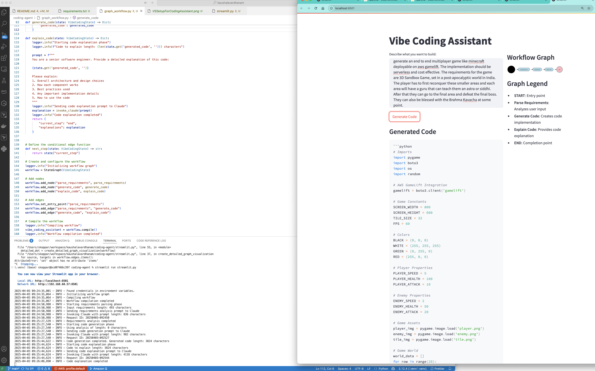

Steps for Coding Assistant usage:
cd coding-agent
1. python3.11 -m venv .venv # Note streamlit does not support 3.12 yet. We may run into "ERROR: Could not build wheels for pyarrow, which is required to install pyproject.toml-based projects" error with python versions >3.11
2. pip install -r requirements.txt
3. Export (set) AWS Credentials in CLI
4. streamlit run code_assistant.py
5. Once you have the setup working, the coding assistant will look as attached:

Once the streamlit frontend launches:
Prompts to play with:
1. code for a multiplayer game using unity which can be deployed on AWS Gamelift servers with user data stored in DynamoDB and S3. The leaderboard implementation in RDS
