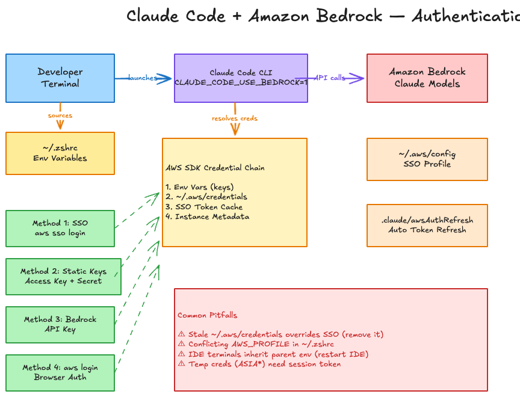

# Setting Up Claude Code with Amazon Bedrock — A Practical Guide

*A developer's walkthrough of the four authentication methods, the gotchas you'll hit, and how to get a seamless "just type claude" experience.*

---

## Why Bedrock?

Claude Code is Anthropic's terminal-based AI coding assistant. By default it authenticates directly with Anthropic's API, but if you're already in the AWS ecosystem, running it through Amazon Bedrock gives you consolidated billing, IAM-based access control, and the ability to use your existing AWS identity infrastructure.

The catch? Getting authentication right can be surprisingly tricky. This post covers the "Quick Start" approach — getting a single developer up and running with Claude Code and Bedrock using SSO or static credentials. For enterprise-scale deployments with Direct IdP integration, user attribution, and centralized monitoring, refer to [Choosing the Right Solution for Claude Code with Amazon Bedrock](https://builder.aws.com/content/33rosWcjqBmkxoBssvzrWSK5ZEJ/choosing-the-right-solution-for-claude-code-with-amazon-bedrock).

This post walks through the four quick-start methods, the real-world issues I ran into, and the final setup that just works.

---

## The Architecture



The flow is straightforward: your terminal sources environment variables from your shell config, Claude Code reads those to know it should use Bedrock, then the AWS SDK credential chain resolves your identity before making API calls to Bedrock. The devil is in the credential resolution order.

---

## The Four Authentication Methods

All methods require this base environment variable:

```bash
export CLAUDE_CODE_USE_BEDROCK=1
export AWS_REGION="us-west-2"  # or your preferred region
```

### Method 1: AWS SSO (Recommended for Teams)

This is the cleanest approach for ongoing use. You authenticate once via browser, and the SDK handles token caching and refresh.

**Setup `~/.aws/config`:**
```ini
[default]
region = us-east-1
sso_session = default
sso_account_id = [your-account-id]
sso_role_name = [your-role-name]

[sso-session default]
sso_start_url = https://[your-org].awsapps.com/start
sso_region = us-east-1
sso_registration_scopes = sso:account:access
```

**Login:**
```bash
aws sso login --profile default
```

**Shell config (`~/.zshrc` or `~/.bashrc`):**
```bash
export CLAUDE_CODE_USE_BEDROCK=1
export AWS_PROFILE="default"
export AWS_REGION="us-west-2"
```

Sessions last up to 12 hours. When they expire, Claude Code can auto-refresh if you configure the refresh hook (covered below).

### Method 2: Static Access Keys

Export credentials directly as environment variables. Quick for testing, not great for production.

```bash
export CLAUDE_CODE_USE_BEDROCK=1
export AWS_ACCESS_KEY_ID=[your-access-key]
export AWS_SECRET_ACCESS_KEY=[your-secret-key]
export AWS_SESSION_TOKEN=[your-session-token]  # required for temporary creds
export AWS_REGION="us-west-2"
```

If your access key starts with `ASIA`, it's a temporary credential and you absolutely need the session token. Missing it causes a cryptic `403 security token invalid` error.

### Method 3: Bedrock API Keys

The simplest option — bypasses AWS credential management entirely.

```bash
export CLAUDE_CODE_USE_BEDROCK=1
export AWS_BEARER_TOKEN_BEDROCK=[your-bedrock-api-key]
export AWS_REGION="us-west-2"
```

No SSO, no credential files, no SDK chain. Just a token.

### Method 4: AWS Login (Browser-Based)

Similar to SSO but uses the newer `aws login` command.

```bash
aws login
export CLAUDE_CODE_USE_BEDROCK=1
export AWS_REGION="us-west-2"
```

---

## Auto-Refresh for SSO Sessions

SSO tokens expire. Rather than manually re-running `aws sso login` every time, configure Claude Code to handle it automatically.

Create `~/.claude/awsAuthRefresh` at the user level so it applies across all projects (or `.claude/awsAuthRefresh` in a project root if you need per-project overrides):

```json
{
  "awsAuthRefresh": "aws sso login --profile default",
  "env": {
    "AWS_PROFILE": "default"
  }
}
```

When Claude Code detects expired credentials, it triggers the SSO login flow automatically.

---

## Optional: Pin Specific Models

```bash
export ANTHROPIC_MODEL='global.anthropic.claude-sonnet-4-5-20250929-v1:0'
export ANTHROPIC_SMALL_FAST_MODEL='us.anthropic.claude-haiku-4-5-20251001-v1:0'
```

---

## Required IAM Permissions

Your role needs these Bedrock permissions at minimum:

```json
{
  "Version": "2012-10-17",
  "Statement": [
    {
      "Effect": "Allow",
      "Action": [
        "bedrock:InvokeModel",
        "bedrock:InvokeModelWithResponseStream",
        "bedrock:ListInferenceProfiles"
      ],
      "Resource": [
        "arn:aws:bedrock:*:*:inference-profile/*",
        "arn:aws:bedrock:*:*:application-inference-profile/*",
        "arn:aws:bedrock:*:*:foundation-model/*"
      ]
    }
  ]
}
```

---

## The Gotchas — What Actually Went Wrong

Here's where theory meets reality. These are the three issues I hit during setup, in the order they appeared.

### Gotcha 1: Conflicting AWS_PROFILE in Shell Config

**What happened:** Running `aws sts get-caller-identity` failed with `The config profile (lakehouse) could not be found`.

**Why:** My `~/.zshrc` had accumulated `AWS_PROFILE` exports from different projects over time:

```bash
# Line 4 — from an old data project
export AWS_PROFILE=lakehouse

# Line 35 — added for Claude Code
export AWS_PROFILE="bedrock"
```

Neither was `default`, which is what my `~/.aws/config` SSO profile was named.

**Fix:** Updated both lines to match the actual profile name:

```bash
export AWS_PROFILE=default
```

**Lesson:** Grep your shell config for `AWS_PROFILE` before debugging anything else. Multiple exports from different projects is surprisingly common.

### Gotcha 2: IDE Terminals Inherit the Parent Process Environment

**What happened:** After fixing `~/.zshrc`, opening a new terminal tab inside the IDE still had the old `AWS_PROFILE` value.

**Why:** IDE-integrated terminals (Kiro, VS Code, etc.) inherit environment variables from the IDE process itself. The IDE was launched before the fix, so its environment still had the old value. A new terminal tab within the IDE just forks from the same parent process.

**Fix:** Restart the IDE entirely. A new terminal tab isn't enough.

**Lesson:** When you change shell config that affects environment variables, restart your IDE — not just the terminal.

### Gotcha 3: Stale Credentials File Overriding SSO

**What happened:** Even after fixing the profile and restarting the IDE, Claude Code returned `403 The security token included in the request is invalid`.

**Why:** `~/.aws/credentials` contained stale temporary credentials from a previous session. The AWS SDK credential chain checks this file before SSO cache. The credentials had an `ASIA`-prefixed access key (temporary) but were missing the `aws_session_token` field — making them invalid but still taking priority over the valid SSO token.

**Fix:** Remove the stale credentials file:

```bash
mv ~/.aws/credentials ~/.aws/credentials.bak
```

**Lesson:** The SDK credential resolution order matters:

```
1. Environment variables (AWS_ACCESS_KEY_ID, etc.)
2. ~/.aws/credentials file          ← stale creds here shadow SSO
3. SSO token cache                  ← valid creds here get ignored
4. Instance metadata / task role
```

If something higher in the chain has invalid credentials, valid credentials lower in the chain never get a chance.

---

## The Final Working Setup

After resolving all three issues, here's the configuration that enables a seamless experience — open any terminal, type `claude`, and it works.

**`~/.aws/config`** — SSO profile:
```ini
[default]
region = us-east-1
sso_session = default
sso_account_id = [your-account-id]
sso_role_name = [your-role-name]

[sso-session default]
sso_start_url = https://[your-org].awsapps.com/start
sso_region = us-east-1
sso_registration_scopes = sso:account:access
```

**`~/.zshrc`** — environment variables (no conflicts):
```bash
export AWS_PROFILE=default
export CLAUDE_MODEL_PROVIDER="bedrock"
export AWS_REGION="us-west-2"
```

**`~/.claude/awsAuthRefresh`** — auto token refresh (user-level, applies to all projects):
```json
{
  "awsAuthRefresh": "aws sso login --profile default",
  "env": {
    "AWS_PROFILE": "default"
  }
}
```

**No `~/.aws/credentials` file** — let SSO handle everything.

**One-time per session:**
```bash
aws sso login --profile default
```

After that, `claude` just works from any terminal.

---

## Quick Troubleshooting Checklist

If Claude Code gives you auth errors with Bedrock:

1. Run `grep AWS_PROFILE ~/.zshrc ~/.bashrc ~/.bash_profile` — look for conflicting values
2. Check if `~/.aws/credentials` exists — if it has stale temp creds, remove or rename it
3. Run `echo $AWS_PROFILE` in the terminal where Claude Code runs — verify it matches your config
4. Run `aws sts get-caller-identity` — if this fails, Claude Code will too
5. If you changed shell config, restart your IDE, not just the terminal

---

## Trivia

This entire troubleshooting journey — diagnosing the conflicting profiles, removing the stale credentials file, and getting Claude Code working with Bedrock — was done with the help of [Kiro](https://kiro.dev), AWS's AI-powered IDE. Kiro also wrote this blog post and generated the architecture diagram using the Excalidraw MCP server integrated into the IDE.

---

## References

- [Claude Code on Amazon Bedrock — Official Docs](https://claude-code.mintlify.app/en/amazon-bedrock)
- [Choosing the Right Solution for Claude Code with Amazon Bedrock](https://builder.aws.com/content/33rosWcjqBmkxoBssvzrWSK5ZEJ/choosing-the-right-solution-for-claude-code-with-amazon-bedrock) — enterprise deployment guidance
- [Claude Code Deployment Patterns with Bedrock — AWS Blog](https://aws.amazon.com/blogs/machine-learning/claude-code-deployment-patterns-and-best-practices-with-amazon-bedrock)
- [Guidance for Claude Code with Amazon Bedrock](https://aws.amazon.com/solutions/guidance/claude-code-with-amazon-bedrock/)
