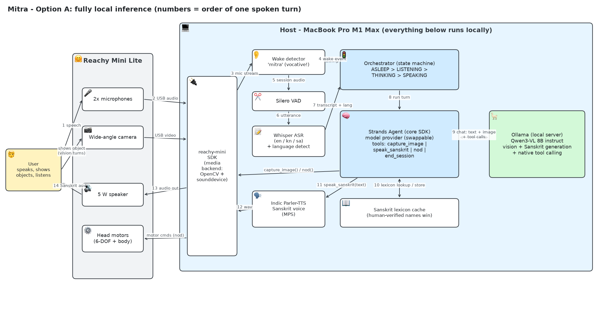
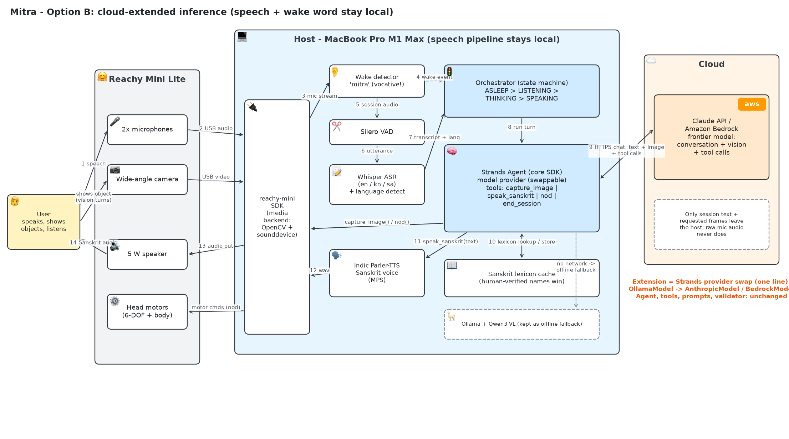
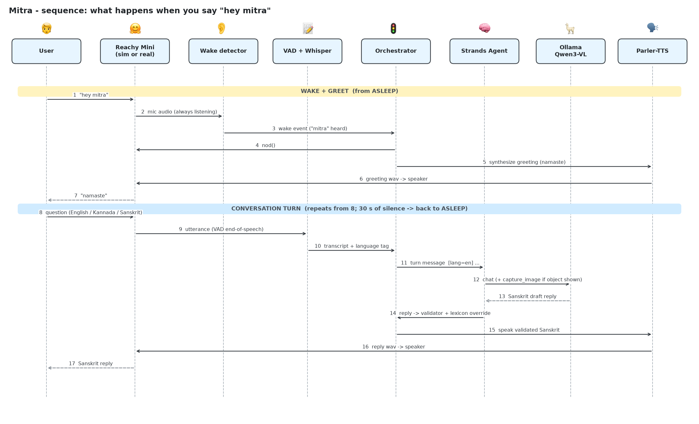

# Mitra — Design Document

**Status:** Design | **Version:** 1.2 (2026-07-08) | **Requirements:** [REQUIREMENTS.md](REQUIREMENTS.md) v1.3

This document describes *how* Mitra is built: module decomposition, the Strands ↔ Reachy Mini integration, data flows, prompting, and error handling. All inference is local (Ollama, Whisper, Indic Parler-TTS on the M1 Max host) per REQUIREMENTS §1; §1.5 shows the cloud extension path.

**Option A — fully local inference (the v1 target):**



**Option B — cloud-extended inference (speech and wake word stay local):**



**Execution sequence on wake (time flows downward; same numbering as the architecture arrows):**



*Editable sources: [architecture-local.excalidraw](architecture-local.excalidraw) · [architecture-cloud.excalidraw](architecture-cloud.excalidraw) · [flow-wake.excalidraw](flow-wake.excalidraw) (open at excalidraw.com or with the VS Code Excalidraw extension).*

---

## 1. Strands + Reachy Mini: How They Connect

This is the question at the heart of the design, so it comes first.

### 1.1 What the Strands robots SDK (`strands-robots`) actually is

The [`strands-robots` lab](https://strandsagents.com/docs/labs/robots/) wraps a **manipulation robot as a Strands agent tool**. Its `Robot` class is built on the **LeRobot** hardware layer and a **Policy** abstraction for vision-language-action (VLA) models:

- `Robot(tool_name=..., robot="so101_follower", cameras={...}, port="/dev/ttyACM0", data_config=...)` — supported robot types are LeRobot arms (SO-100/SO-101).
- The control loop sends *observations* (camera frames + joint states) to a *policy* (e.g. NVIDIA GR00T behind a ZMQ inference server) and executes the returned *action chunks* (joint trajectories) at ~50 Hz.
- The tool exposes four actions to the agent: `execute` (blocking), `start` (background), `status`, `stop`.

### 1.2 Why Mitra doesn't use `strands-robots` directly

| `strands-robots` assumes | Reachy Mini / Mitra reality |
|---|---|
| LeRobot driver for the robot type | No Reachy Mini driver; the robot speaks its own `reachy-mini` SDK |
| Actions = joint trajectories from a VLA policy | Mitra's "actions" are *speak*, *nod*, *capture image* — no manipulation, no policy inference |
| GPU VLA inference server (GR00T, TensorRT/ZMQ) | Nothing to run a VLA on; Qwen3-VL via Ollama is a *language* model, not an action policy |

Forcing Reachy Mini into the `Robot`/`Policy` interface would mean writing a LeRobot driver and a fake policy for a robot with no arms — machinery without benefit.

### 1.3 What Mitra takes from it: the robot-as-tool pattern

Mitra uses the **core `strands` SDK** and applies `strands-robots`' central idea — *the robot is a tool the agent can call* — with tools we define ourselves over the `reachy-mini` SDK:

```python
# src/agent/tools.py
from strands import tool
from mitra.robot.reachy import robot      # singleton wrapper over reachy_mini SDK
from mitra.speech.tts import synthesize   # Indic Parler-TTS on MPS

@tool
def capture_image() -> dict:
    """Capture one frame from Reachy Mini's camera (use when the user shows an object)."""
    frame = robot.camera.read()             # numpy (H, W, 3) uint8 via reachy-mini SDK
    return {"format": "jpeg", "source": {"bytes": jpeg_bytes(frame)}}

@tool
def speak_sanskrit(text_devanagari: str) -> str:
    """Speak Sanskrit text (Devanagari) through the robot's speaker."""
    wav = synthesize(text_devanagari)
    robot.speaker.play(wav)                 # plays via SDK media backend
    return "spoken"

@tool
def nod() -> str:
    """Briefly nod the head (wake acknowledgment)."""
    robot.head.nod()
    return "ok"

@tool
def end_session() -> str:
    """End the conversation and return to wake-word listening."""
    return "session_end"                    # orchestrator interprets this sentinel
```

```python
# src/agent/agent.py
from strands import Agent
from strands.models.ollama import OllamaModel
from .tools import capture_image, speak_sanskrit, nod, end_session
from .prompts import SANSKRIT_SYSTEM_PROMPT

model = OllamaModel(host="http://localhost:11434",
                    model_id="qwen3-vl:8b-instruct", temperature=0.3)
agent = Agent(model=model,
              tools=[capture_image, speak_sanskrit, nod, end_session],
              system_prompt=SANSKRIT_SYSTEM_PROMPT)
```

The `OllamaModel` provider keeps orchestration code independent of where inference runs — pointing the same agent at a cloud provider later is a one-line config change (REQUIREMENTS FR-6.3).

We also adopt `strands-robots`' **`execute`/`start`/`status`/`stop` action shape** for the one genuinely long-running robot operation — speaking. `speak_sanskrit` internally starts playback on a worker thread and the orchestrator can `stop` it (barge-in: user says "mitra" again mid-reply → playback stops).

### 1.4 Tool invocation: model-invoked (Qwen3-VL), with deterministic guardrails

The primary model is **Qwen3-VL 8B Instruct**, chosen over Gemma 3 12B precisely because it exposes **native tool calling through Ollama** (use the `:8b-instruct` tag — the bare `:8b` tag is the *thinking* variant, which burns the latency budget on reasoning tokens and returns empty content; its Ollama library entry is tagged `tools` + `vision`; Gemma 3 has no native tool support in Ollama). That makes the Strands agent loop work as designed:

- The **model invokes `capture_image()` itself** when the user asks about an object — the returned frame flows back into the same multimodal turn, and Qwen3-VL answers from the image. A config flag (`agent.deterministic_vision: true|false`) keeps the v1.0 orchestrator-mediated intent-check path available as a reliability fallback and for A/B testing.
- Two calls stay **deterministic regardless of model**: `nod()` fires on the wake event, and every reply is routed through the validator and then `speak_sanskrit()` by the orchestrator — a small local model is never trusted to decide *whether* to validate or speak.
- The Strands `Agent` owns the conversation loop, message history, and provider abstraction.

If the Phase 3 bake-off selects Gemma 3 instead, the same `@tool` definitions keep working via the deterministic path — the tool interface is model-agnostic.

### 1.5 Extending to the cloud: a provider swap

Option B (second diagram above) changes exactly one construction line — the Strands model provider:

```python
# local (Option A)
model = OllamaModel(host="http://localhost:11434", model_id="qwen3-vl:8b-instruct")
# cloud (Option B) — e.g. Claude API or Amazon Bedrock
model = AnthropicModel(model_id="claude-sonnet-5")          # or BedrockModel(...)
```

Everything else — the `Agent`, the four tools, prompts, validator, lexicon, orchestrator — is unchanged. The privacy boundary also holds in Option B: wake word, VAD, ASR, and TTS remain on the host, so only session *text* and explicitly captured frames cross the network; raw microphone audio never does. The local Ollama model is kept installed as an offline fallback (dashed path in the diagram): on network failure the orchestrator swaps the provider back and continues degraded rather than dying.

## 2. Module Decomposition

```
mitra/
├── README.md · REQUIREMENTS.md · DESIGN.md · CLAUDE.md
├── architecture-local.{excalidraw,png} · architecture-cloud.{excalidraw,png}
├── scripts/gen_diagrams.py          # regenerates both diagram pairs from one spec
├── config.yaml                  # models, thresholds, timeouts, feature flags
├── main.py                      # entry point: wiring + run loop
├── src/
│   ├── orchestrator.py          # state machine (§3)
│   ├── robot/reachy.py          # thin wrapper over reachy-mini SDK: camera, speaker, head
│   ├── audio/
│   │   ├── wake.py              # openWakeWord runner ("mitra" model)
│   │   ├── vad.py               # Silero VAD segmentation
│   │   └── asr.py               # whisper.cpp/mlx-whisper (en, kn) + HF Sanskrit fine-tune
│   ├── language_detector.py     # per-utterance en/kn/sa detection (ported concept)
│   ├── speech/tts.py            # Indic Parler-TTS (MPS); VITS fallback behind same interface
│   ├── agent/
│   │   ├── agent.py             # Strands Agent + OllamaModel construction
│   │   ├── tools.py             # @tool wrappers over robot + TTS (§1.3)
│   │   ├── prompts.py           # system prompt, few-shot exchanges, vision prompt
│   │   └── validator.py         # Devanagari/length validation + retry (§5)
│   ├── lexicon/store.py         # SQLite object-name cache (§6)
│   └── logging_subsystem.py     # structured per-turn logs (ported concept)
└── tests/                       # pytest; module-per-module, mocks for robot + Ollama
```

Every hardware- or model-touching module hides behind a small interface so tests run with fakes: `robot/reachy.py` has a `FakeReachy` twin; `agent/agent.py` accepts any Strands model provider.

## 3. Orchestrator State Machine

| State | Entered on | Active components | Exits |
|---|---|---|---|
| `ASLEEP` | startup, session end | openWakeWord only | wake word → `WAKING` |
| `WAKING` | wake detection | `nod()`, greeting via TTS | done → `LISTENING` |
| `LISTENING` | greeting/reply finished | VAD + ASR | utterance → `THINKING`; 30 s silence → `ASLEEP` |
| `THINKING` | transcript ready | language detect, intent check, optional `capture_image()`, Strands agent → Ollama, validator | reply valid → `SPEAKING`; `end_session` → `ASLEEP` |
| `SPEAKING` | validated reply | TTS + speaker playback | playback done → `LISTENING`; wake word (barge-in) → stop playback → `LISTENING` |

Single-threaded core with two daemon threads: the always-on wake-word listener and the TTS playback worker. State transitions are the only cross-thread communication (queue of events), which keeps the concurrency surface tiny.

## 4. Turn Flows

**Wake:** mic stream → openWakeWord fires → orchestrator: `nod()` + speak *नमस्ते* → `LISTENING`.

**Conversation turn:** VAD end-of-utterance → ASR (Whisper, language auto-detect en/kn; Sanskrit model when detector says `sa`) → orchestrator builds turn message `[lang=kn] <transcript>` → Strands agent → Ollama/Qwen3-VL → validator (§5) → `speak_sanskrit()` → back to `LISTENING`.

**Vision turn:** same until the model (or, with `deterministic_vision`, the intent check) triggers `capture_image()` → **lexicon lookup first**: if the recognized object (Qwen3-VL asked for an English identification + Sanskrit name in one JSON response) is already in the verified lexicon, the cached Sanskrit name replaces the generated one → reply assembled (*एतत् … अस्ति*) → validator → spoken. New objects are written to the lexicon as `unverified` for later human review.

## 5. Prompting & Output Validation

- **System prompt** (in `prompts.py`): persona (friendly Sanskrit-speaking robot friend), hard rules (reply only in Sanskrit/Devanagari, ≤ 2 short sentences, simple laukika register, no sandhi-heavy constructions), followed by ~8 **few-shot exchanges** covering greetings, object naming, simple Q&A, and graceful "I don't know" — few-shot steering matters far more for a 12B local model than for frontier models.
- **Vision prompt**: asks for strict JSON — `{"object_en": ..., "name_sa_devanagari": ..., "name_iast": ..., "sentence_sa": ...}` — parsed, then only `sentence_sa` (with lexicon substitution) is spoken.
- **Validator** (`validator.py`): checks the reply is ≥ 80 % Devanagari codepoints, ≤ 220 chars, and non-empty. Failure → one retry with a corrective suffix ("उत्तरं संस्कृतेन एव देहि …"); second failure → fixed safe phrase, and (only if an API key is configured) the optional cloud fallback path (FR-6.3).

## 6. Lexicon Store

SQLite table `lexicon(object_en TEXT PRIMARY KEY, name_devanagari TEXT, name_iast TEXT, gloss_en TEXT, verified INTEGER, updated_at TEXT)`. Ships pre-seeded with ~100 human-verified everyday objects (FR-2.6). Verified rows always override model output; unverified rows are review candidates surfaced by a `mitra-lexicon review` CLI helper. This is the primary accuracy mechanism compensating for local-model Sanskrit (REQUIREMENTS R1/R2).

## 7. Configuration (`config.yaml`)

```yaml
models:
  llm: {provider: ollama, host: "http://localhost:11434", id: "qwen3-vl:8b-instruct", keep_alive: "30m"}
  asr: {default: "whisper-large-v3", sanskrit: "<hf-sanskrit-finetune>", backend: "mlx"}
  tts: {engine: "indic-parler-tts", fallback: "indic-tts-vits", device: "mps"}
  wake: {engine: "openwakeword", model: "models/mitra.onnx", threshold: 0.6}
cloud_fallback: {enabled: false, provider: null}   # FR-6.3; absent key == feature absent
session: {silence_timeout_s: 30, max_reply_chars: 220}
```

`keep_alive: 30m` keeps Qwen3-VL resident in Ollama between turns — reload latency would otherwise dominate the turn budget (REQUIREMENTS §8).

## 8. Error Handling

| Failure | Detection | Behavior |
|---|---|---|
| Ollama down / timeout | HTTP error, 20 s deadline | Spoken apology (*क्षम्यताम्, पुनः वदतु*), log, stay in `LISTENING` |
| ASR empty/garbage | empty transcript, low confidence | Sanskrit "please repeat" prompt |
| Camera read failure | SDK exception | Sanskrit "show me again" + log |
| Validator double-failure | §5 | Safe phrase; optional cloud fallback if configured |
| Robot disconnected (USB) | SDK heartbeat | Console alert, pipeline pauses in `ASLEEP` |

## 9. Testing Strategy

- **Unit:** validator (property tests on Devanagari ratio), lexicon store, intent matcher, state-machine transitions (table-driven, `FakeReachy`, canned agent).
- **Integration (no robot):** full turn with recorded WAV fixtures → wake → ASR → mocked Ollama → TTS to file; asserts latency budget instrumentation fires.
- **Hardware smoke (`tests/hw/`, skipped in CI):** camera frame shape, speaker tone, nod — Phase 0's checklist, kept runnable forever.
- **Sanskrit quality harness:** fixed prompt set + scoring sheet for the Phase 3 model bake-off; results committed alongside the chosen model id.

## 10. Design Decisions & Alternatives Considered

| # | Decision | Alternative rejected | Why |
|---|---|---|---|
| D1 | Core `strands` + custom tools | `strands-robots` `Robot`/`Policy` | No LeRobot driver or VLA policy applies to Reachy Mini (§1.2) |
| D2 | Model-invoked tool calls (Qwen3-VL native tools) with deterministic speech/validation path | Orchestrator-only mediation | Qwen3-VL supports tools natively in Ollama; validator + speak stay deterministic so model quality can't skip guardrails (§1.4) |
| D3 | One multimodal tool-capable model (Qwen3-VL 8B) | Gemma 3 12B (no Ollama tool support); Qwen3 text + separate VLM (two resident models) | Single ~6 GB model covers conversation, vision, and tools; bake-off in Phase 3 may revise (REQUIREMENTS §6) |
| D4 | SQLite lexicon, verified-wins | Pure generation | Deterministic correctness for repeat objects; human-in-the-loop quality (R1/R2) |
| D5 | Wake word + VAD gating before any model | Always-on ASR | Privacy (FR-1.2) and keeps the Mac's memory/compute idle when asleep |
