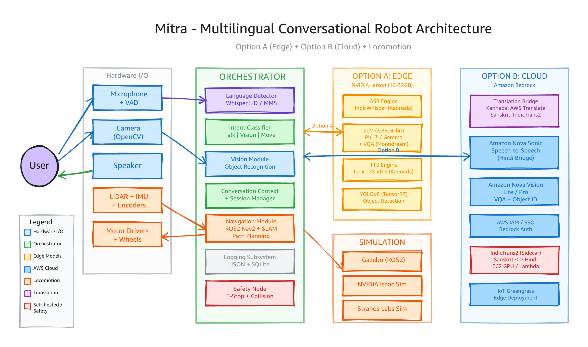

# Mitra - Multilingual Conversational Robot

**Status:** Design & Feasibility Phase | **Languages:** Sanskrit, Kannada | **Cohort:** 3

Mitra is a multilingual conversational robot with vision and audio capabilities, designed to let users converse naturally in Sanskrit or Kannada, show physical objects to the robot's camera, and receive accurate spoken responses about those objects.

The name "Mitra" (मित्र) means "friend" in Sanskrit — reflecting the robot's role as a helpful, approachable companion for natural language interaction.

---

## Table of Contents

- [Overview](#overview)
- [Deployment Modes](#deployment-modes)
- [System Architecture](#system-architecture)
- [Subsystem Descriptions](#subsystem-descriptions)
- [Technology Stack](#technology-stack)
- [Feasibility Summary](#feasibility-summary)
- [Phased Implementation Plan](#phased-implementation-plan)
- [Hardware Requirements](#hardware-requirements)
- [AWS Services (Option B)](#aws-services-option-b)
- [Reusable Components from Speaking Buddy](#reusable-components-from-speaking-buddy)
- [Project Structure](#project-structure)
- [Getting Started](#getting-started)
- [References](#references)

---

## Overview

Mitra supports two deployment modes that address different infrastructure constraints:

| Aspect | Option A (Edge-Only) | Option B (Cloud) |
|--------|---------------------|------------------|
| **Compute** | All inference on-device (Jetson) | Heavy inference via Amazon Bedrock |
| **Connectivity** | Fully offline | Requires internet |
| **Pipeline** | ASR -> SLM -> TTS (discrete steps) | Nova Sonic speech-to-speech |
| **Vision** | YOLOv8/MobileNet on-device | Amazon Nova Vision via Bedrock |
| **Model Size** | 1B-7B parameter range | Cloud-scale models |
| **Latency** | 8-20s end-to-end (realistic) | 5-9s end-to-end |
| **Sanskrit Support** | Currently Not feasible (no models exist) | Via Translation Bridge (experimental) |
| **Kannada Support** | Feasible | Feasible |

---

## Deployment Modes

### Option A - Edge-Only Mode

All inferencing runs on an embedded edge compute platform (NVIDIA Jetson). No cloud dependency. The pipeline is:

```
Microphone -> VAD -> Language Detection -> ASR -> SLM (+ Vision features) -> TTS -> Speaker
```

**Best for:** Offline environments, privacy-sensitive deployments, Kannada-only use cases.

**Limitations:** Sanskrit ASR/TTS models do not exist. VQA latency exceeds 5s targets. Memory is tight on 16GB Jetson.

### Option B - Cloud Mode (Amazon Nova Sonic)

Speech-to-speech processing is offloaded to Amazon Nova Sonic via Amazon Bedrock. Vision queries use Amazon Nova vision models (Nova Lite or Nova Pro).

```
Microphone -> VAD -> Language Detection -> [Translation Bridge] -> Nova Sonic -> [Translation Bridge] -> Speaker
                                                                      |
Camera -> Image Capture -> [Translation Bridge] -> Nova Vision -> [Translation Bridge] -> Speaker
```

**Best for:** Best quality responses, Sanskrit support (experimental via Hindi bridge), lower on-device compute.

**Limitations:** Requires internet. Sanskrit translation is high-risk (Amazon Translate does not support Sanskrit). Adds 2-4s latency when Translation Bridge is active.

---

## System Architecture



*Architecture showing all subsystems across Hardware I/O, Orchestrator, Edge (Option A), Cloud (Option B), Locomotion, and Simulation layers. Editable source: [architecture-diagram.excalidraw](architecture-diagram.excalidraw)*

### Data Flow - Option A (Edge)

```
1. User speaks into microphone
2. VAD detects speech onset, begins recording
3. Silence (1.5s) triggers recording finalization
4. Language Detector identifies Sanskrit or Kannada (< 2s)
5. ASR Engine transcribes speech to text in Active_Language (< 3s)
6. If Object_Query detected AND object presented:
   a. Vision Module captures frame from camera
   b. Vision Module extracts features + object label (< 3s)
   c. SLM receives transcribed text + visual features
7. Else: SLM receives transcribed text only
8. SLM generates response text in Active_Language
9. TTS Engine synthesizes response audio (< 2s)
10. Audio plays through speaker
11. Interaction logged as structured JSON
```

### Data Flow - Option B (Cloud)

```
1. User speaks into microphone
2. VAD detects speech onset, begins recording
3. Language Detector identifies Sanskrit or Kannada (< 2s)
4. If Active_Language not supported by Nova Sonic:
   a. Translation Bridge converts speech/text to Bridge_Language (Hindi)
5. Audio streamed to Nova Sonic via Bedrock API (bidirectional)
6. If Object_Query detected:
   a. Vision Module captures frame from camera
   b. Query text + image sent to Nova Vision via Bedrock API
   c. Response received in Bridge_Language
7. If Translation Bridge active:
   a. Response translated back to Active_Language
8. Audio response plays through speaker
9. Interaction logged as structured JSON
```

---

## Subsystem Descriptions

### 1. Language Detector

Identifies whether the user is speaking Sanskrit or Kannada. Sanskrit (Indo-Aryan) and Kannada (Dravidian) are phonologically distinct, making binary classification reliable.

| Property | Detail |
|----------|--------|
| **Latency target** | < 2 seconds from utterance completion |
| **Confidence threshold** | 0.75 - below this, user is prompted to repeat |
| **Candidate models** | Whisper LID, Meta MMS LID |
| **Edge memory** | ~300 MB |
| **Caveat** | Unreliable for very short utterances (1-2 words) |

### 2. Audio I/O

Handles microphone input, speaker output, and Voice Activity Detection (VAD).

| Property | Detail |
|----------|--------|
| **Input** | Connected microphone, mono, 16kHz or 22.05kHz |
| **Output** | Connected speaker |
| **VAD** | Detects speech onset; 1.5s silence finalizes recording |
| **Libraries** | PyAudio/ALSA for I/O, webrtcvad or silero-vad for VAD |
| **Idle behavior** | After 30s silence, enters idle listening state |

### 3. Vision Module

Captures images from a connected camera sensor and performs object recognition.

| Property | Option A (Edge) | Option B (Cloud) |
|----------|----------------|------------------|
| **Minimum resolution** | 640x480 | 640x480 |
| **Object recognition** | YOLOv8-small / MobileNet | Amazon Nova Lite/Pro |
| **VQA** | English VLM + translate (8-15s) | Nova Vision API (< 6s) |
| **Categories** | Fruits, vegetables, tools, utensils, animals, household items | Same + broader via Nova |
| **Edge memory** | ~300 MB | Minimal (cloud offloaded) |
| **Confidence threshold** | 0.5 - below this, user told object unidentified |

### 4. ASR Engine (Option A Only)

Converts spoken audio into text on-device.

| Property | Kannada | Sanskrit |
|----------|---------|----------|
| **Model** | AI4Bharat IndicWhisper | No usable model exists |
| **WER (read speech)** | ~15-25% | N/A |
| **WER (conversational)** | ~25-35% | N/A |
| **Latency** | 2-4s on Jetson Orin with TensorRT | N/A |
| **Edge memory** | ~1.5 GB (Whisper medium) | N/A |
| **Feasibility** | FEASIBLE | NOT FEASIBLE |

### 5. TTS Engine (Option A Only)

Synthesizes spoken audio from text on-device.

| Property | Kannada | Sanskrit |
|----------|---------|----------|
| **Model** | AI4Bharat IndicTTS (VITS) | No model exists |
| **Latency** | 0.5-1.5s on Jetson | N/A |
| **Edge memory** | ~200 MB | N/A |
| **Feasibility** | FEASIBLE | NOT FEASIBLE |

### 6. SLM - Small Language Model (Option A Only)

Handles language understanding, response generation, and VQA on-device.

| Property | Detail |
|----------|--------|
| **Target size** | 1B-7B parameters (3B recommended for 16GB Jetson) |
| **Quantization** | 4-bit (GPTQ/AWQ) required to fit in memory |
| **Candidate models** | Phi-3-mini (3.8B), Gemma-2B, LLaMA-3.2-3B |
| **Edge memory** | ~2.5-3 GB at 4-bit quantization |
| **Sanskrit generation** | NOT FEASIBLE - no SLM generates grammatically correct Sanskrit |
| **Kannada generation** | Limited but functional |
| **VQA approach** | English VLM (Moondream/LLaVA-Phi) + on-device translate |

### 7. Translation Bridge (Option B Only)

Translates between the user's Active_Language and a Nova Sonic-supported Bridge_Language (Hindi).

| Property | Kannada -> Hindi | Sanskrit -> Hindi |
|----------|-----------------|-------------------|
| **Service** | Amazon Translate | Self-hosted IndicTrans2 (AI4Bharat) |
| **AWS support** | Yes - native | No - Sanskrit not in Amazon Translate |
| **Translation quality** | Good (moderate semantic drift) | Moderate (BLEU ~20-30) |
| **Double-translation error** | Low-moderate | High - expect 20-40% semantic degradation |
| **Latency per step** | < 2s | Variable (depends on hosting) |
| **Model size (self-hosted)** | N/A | 200M-1.1B params on GPU/Lambda |

### 8. Nova Sonic Integration (Option B Only)

Amazon Nova Sonic provides speech-to-speech processing via Amazon Bedrock.

| Property | Detail |
|----------|--------|
| **Supported languages** | English (US/UK/IN/AU), French, Italian, German, Spanish, Portuguese, Hindi |
| **Sanskrit/Kannada** | NOT directly supported - requires Translation Bridge |
| **Bridge_Language** | Hindi (best choice - linguistically closest to Sanskrit, good NMT for Kannada) |
| **Latency (direct)** | < 5s for Hindi |
| **Latency (with bridge)** | 7-9s (2s translate in + processing + 2s translate out) |
| **Connection limit** | 8 minutes per connection (supports renewal) |
| **API** | Bedrock bidirectional streaming API |

### 9. Orchestrator

Central coordinator that manages the flow between all subsystems.

**Responsibilities:**
- Route queries between speech and vision pipelines
- Maintain conversation context for the session duration
- Manage Active_Language switching when Language Detector output changes
- Handle graceful degradation (missing camera, microphone, network)
- Coordinate model loading at startup (Option A: < 120s)
- Manage Translation Bridge bypass when Nova Sonic adds native language support
- Retry failed Bedrock API requests once before reporting errors (Option B)

### 10. Logging Subsystem

Serializes all interactions as structured JSON for debugging and improvement.

**Log entry schema:**
```json
{
  "timestamp": "ISO-8601",
  "active_language": "sa|kn",
  "deployment_mode": "edge|cloud",
  "query": {
    "transcribed_text": "...",
    "source": "asr|nova_sonic"
  },
  "vision": {
    "object_label": "...",
    "confidence_score": 0.0,
    "image_path": "..."
  },
  "response": {
    "text": "...",
    "translation_bridge_used": true,
    "bridge_language": "hi"
  },
  "confidence_scores": {
    "language_detection": 0.0,
    "object_recognition": 0.0
  },
  "latency_ms": {
    "language_detection": 0,
    "asr": 0,
    "slm": 0,
    "tts": 0,
    "total": 0
  }
}
```

---

## Technology Stack

### Option A - Edge

| Layer | Technology |
|-------|-----------|
| **Hardware** | NVIDIA Jetson Orin NX (16GB minimum, 32GB recommended) |
| **OS** | JetPack / Ubuntu |
| **Runtime** | Python 3.10+, CUDA, TensorRT |
| **ASR** | AI4Bharat IndicWhisper (Kannada), Whisper medium (TensorRT) |
| **TTS** | AI4Bharat IndicTTS / VITS (Kannada) |
| **SLM** | Phi-3-mini 3.8B (4-bit quantized) or Gemma-2B |
| **Vision** | YOLOv8-small / MobileNet (TensorRT), Moondream 1.8B for VQA |
| **Language ID** | Whisper LID or Meta MMS LID |
| **Audio I/O** | PyAudio, ALSA, webrtcvad / silero-vad |
| **Camera** | OpenCV (cv2) |
| **Logging** | SQLite + JSON serialization |

### Option B - Cloud

| Layer | Technology |
|-------|-----------|
| **Hardware** | Any Linux/macOS device with microphone, speaker, camera |
| **Cloud platform** | AWS (Amazon Bedrock) |
| **Speech-to-speech** | Amazon Nova Sonic (via Bedrock bidirectional streaming API) |
| **Vision/VQA** | Amazon Nova Lite or Nova Pro (via Bedrock Invoke/Converse API) |
| **Translation (Kannada)** | Amazon Translate (Kannada <-> Hindi) |
| **Translation (Sanskrit)** | Self-hosted AI4Bharat IndicTrans2 (on EC2 GPU or Lambda) |
| **Language ID** | Whisper LID or Meta MMS LID (runs locally) |
| **Audio I/O** | PyAudio, webrtcvad / silero-vad |
| **Camera** | OpenCV (cv2) |
| **Auth** | AWS SSO / IAM (see `CLAUDE_CODE_BEDROCK_SETUP.md`) |
| **Logging** | SQLite + JSON serialization |

---

## Feasibility Summary

### What Works

- Kannada ASR on edge (AI4Bharat IndicWhisper, WER ~25-35% conversational)
- Kannada TTS on edge (AI4Bharat IndicTTS VITS models)
- Language detection for Sanskrit vs Kannada (phonologically distinct families)
- Object recognition on edge (YOLOv8/MobileNet at 30+ FPS on Jetson)
- Cloud VQA via Nova Vision (< 6s with translation)
- Nova Sonic speech-to-speech with Hindi as Bridge_Language
- Kannada <-> Hindi translation via Amazon Translate
- All hardware interfaces (audio I/O, camera, VAD)
- Logging and serialization

### What Does NOT Work

- **Sanskrit ASR** - No usable conversational model exists (edge or cloud)
- **Sanskrit TTS** - No off-the-shelf model exists anywhere
- **Sanskrit in SLM** - No 1B-7B model generates grammatically correct Sanskrit
- **Sanskrit in Amazon Translate** - Not a supported language
- **Edge VQA in 5s** - Realistic pipeline is 8-15s
- **7B SLM on 16GB Jetson** - Does not fit alongside other models; must use 3B

### What Works With Caveats

- **Sanskrit via Translation Bridge** (Option B) - Requires self-hosted IndicTrans2. Double translation (Sanskrit -> Hindi -> Sanskrit) degrades semantics in 20-40% of interactions. Should be labeled "experimental."
- **Edge memory on 16GB Jetson** - Fits with 3B SLM at 4-bit quantization (~7-8.6 GB total). No margin for 7B. Requires specifying Jetson variant in requirements.
- **End-to-end latency with bridge** - 7-9s vs. the 5s target. Requirements should add +4s allowance when bridge is active.

### Acceptance Criteria At Risk

| AC | Issue |
|----|-------|
| AC4.3 | "Grammatically correct" Sanskrit generation - no model can do this |
| AC6.2 | Sanskrit ASR on edge - no model exists |
| AC7.2 | Sanskrit TTS on edge - no model exists |
| AC7.4 | "Correct pronunciation" for Sanskrit TTS - unverifiable |
| AC9.4 | VQA within 5s on edge - realistically 8-15s |
| AC11.3 | 5s response with Translation Bridge - realistically 7-9s |
| AC12.3 | "Preserve semantic meaning" for Sanskrit - high error rate |

---

## Phased Implementation Plan

### Phase 1: Foundation (Option B, Kannada)

Build the cloud-mode pipeline with Kannada as the primary language.

1. Set up project structure, configuration, and logging subsystem
2. Implement audio I/O with VAD (reuse `speaking_buddy/src/audio_processor.py` patterns)
3. Implement language detection (Whisper LID - Kannada vs Sanskrit binary)
4. Integrate Amazon Nova Sonic via Bedrock API for Kannada -> Hindi -> Kannada
5. Integrate Amazon Translate for Kannada <-> Hindi Translation Bridge
6. Implement Orchestrator with conversation context management
7. Set up structured JSON logging (reuse `speaking_buddy/src/database.py` patterns)

### Phase 2: Cloud Vision (Option B)

Add camera and VQA capabilities via Nova Vision.

1. Implement camera capture with OpenCV
2. Integrate Nova Vision (Lite/Pro) for object recognition and VQA
3. Add Object_Query routing in Orchestrator (vision vs. general)
4. Implement follow-up question handling (reuse last captured frame)
5. Add Translation Bridge for vision query/response

### Phase 3: Sanskrit Cloud Support (Option B, Experimental)

Add Sanskrit as a second language with clear "experimental" labeling.

1. Self-host IndicTrans2 for Sanskrit <-> Hindi translation
2. Deploy as sidecar service (EC2 GPU instance or Lambda with container)
3. Integrate into Translation Bridge with fallback handling
4. Test and measure semantic degradation rates
5. Add quality monitoring and confidence-based disclaimers

### Phase 4: Edge Deployment (Option A, Kannada Only)

Port the Kannada pipeline to run fully on-device.

1. Set up Jetson Orin NX environment (JetPack, CUDA, TensorRT)
2. Deploy AI4Bharat IndicWhisper for Kannada ASR (TensorRT optimized)
3. Deploy AI4Bharat IndicTTS VITS for Kannada TTS
4. Deploy Phi-3-mini 3.8B (4-bit quantized) as SLM
5. Deploy YOLOv8-small for object recognition (TensorRT)
6. Deploy Moondream 1.8B for edge VQA (English + translate)
7. Profile and optimize total memory usage (target: < 10 GB)
8. Implement startup model loading with < 120s target

### Phase 5: Edge Vision & Optimization (Option A)

Polish the edge experience and optimize latencies.

1. Integrate edge VQA pipeline (Vision + SLM + translate)
2. Optimize ASR latency with TensorRT and batch scheduling
3. Add graceful degradation for hardware failures
4. Benchmark end-to-end latencies and document realistic expectations
5. Add mode switching (Edge <-> Cloud) when network state changes

### Future: Sanskrit Edge (Pending Model Availability)

Deferred until Sanskrit ASR/TTS models are trained or become available.

1. Train custom Sanskrit VITS TTS model (requires 10-20h corpus)
2. Fine-tune Whisper on conversational Sanskrit data
3. Fine-tune SLM for Sanskrit generation
4. Integrate and benchmark on Jetson

---

## Hardware Requirements

### Option A - Edge Device

| Component | Minimum | Recommended |
|-----------|---------|-------------|
| **Compute board** | NVIDIA Jetson Orin NX 16GB | NVIDIA Jetson AGX Orin 32GB |
| **Storage** | 64GB NVMe SSD | 256GB NVMe SSD |
| **Camera** | USB camera, 640x480 min | USB camera, 1080p |
| **Microphone** | USB microphone or I2S MEMS | Directional USB microphone |
| **Speaker** | 3.5mm or USB speaker | Powered USB speaker |
| **Power** | Per Jetson spec | Per Jetson spec |

**Memory budget (16GB Jetson):**

```
OS + Runtime .............. 2-3 GB
ASR (Whisper medium) ...... 1.5 GB
SLM (3.8B, 4-bit) ........ 2.5-3 GB
TTS (VITS) ................ 0.2 GB
Vision (YOLOv8-small) ..... 0.3 GB
Language Detection ........ 0.3 GB
Buffers ................... 0.3 GB
                            --------
Total ..................... 7.1-8.6 GB (of 16 GB available)
```

### Option B - Client Device

Any machine with a microphone, speaker, camera, Python 3.10+, and internet connectivity. No GPU required on-device.

---

## AWS Services (Option B)

| Service | Purpose | Pricing Model |
|---------|---------|---------------|
| **Amazon Bedrock** | API gateway for Nova Sonic and Nova Vision | Per-token / per-second |
| **Amazon Nova Sonic** | Speech-to-speech processing (Hindi as Bridge_Language) | Per-second of audio |
| **Amazon Nova Lite/Pro** | Vision-based object recognition and VQA | Per-token (input + output) |
| **Amazon Translate** | Kannada <-> Hindi translation | Per-character |
| **Amazon EC2** (GPU) | Self-hosted IndicTrans2 for Sanskrit <-> Hindi | Per-hour (GPU instance) |
| **AWS IAM / SSO** | Authentication and authorization | Free |
| **Amazon S3** (optional) | Log storage and image archival | Per-GB stored |

**Authentication:** See [`CLAUDE_CODE_BEDROCK_SETUP.md`](CLAUDE_CODE_BEDROCK_SETUP.md) for detailed Bedrock authentication setup including SSO, static keys, and auto-refresh configuration.

**Required IAM permissions:**
```json
{
  "Version": "2012-10-17",
  "Statement": [
    {
      "Effect": "Allow",
      "Action": [
        "bedrock:InvokeModel",
        "bedrock:InvokeModelWithResponseStream",
        "bedrock:ListInferenceProfiles",
        "translate:TranslateText",
        "translate:ListLanguages"
      ],
      "Resource": "*"
    }
  ]
}
```

---

## Reusable Components from Speaking Buddy

The `speaking_buddy/` project (Cohort 2) provides several patterns and utilities that can be adapted for Mitra.

| Component | Source | What to Reuse |
|-----------|--------|---------------|
| **Audio preprocessing** | `speaking_buddy/src/audio_processor.py` | `load_audio()`, `normalize_audio()`, `trim_silence()`, `extract_mfcc()` - all language-agnostic |
| **Database pattern** | `speaking_buddy/src/database.py` | SQLite connection management, `get_connection()`, table creation pattern, session tracking schema |
| **Session lifecycle** | `speaking_buddy/src/session_manager.py` | `SessionManager` class structure - create, track progress, record attempts, summarize |
| **Configuration pattern** | `speaking_buddy/src/config.py` | `SAMPLE_RATE`, `SCORE_THRESHOLDS`, directory setup with `Path`, constants organization |
| **Bedrock auth** | `mitra/CLAUDE_CODE_BEDROCK_SETUP.md` | SSO setup, IAM permissions, credential chain, auto-refresh configuration |

**Not reusable:** Pronunciation analysis, Praat integration, Luxembourgish word bank, Streamlit UI, feature comparison logic.

**Estimated reuse: ~15-20% of speaking_buddy code is architecturally applicable.**

---

## Project Structure

Target project layout for Mitra:

```
mitra/
  README.md                          # This document
  CLAUDE_CODE_BEDROCK_SETUP.md       # Bedrock auth guide (existing)
  claude-bedrock-auth-flow.png       # Auth flow diagram (existing)
  requirements.txt                   # Python dependencies
  config.py                          # Configuration constants
  main.py                            # Entry point
  src/
    orchestrator.py                  # Central coordinator
    language_detector.py             # Sanskrit/Kannada identification
    audio_io.py                      # Microphone input, speaker output, VAD
    vision_module.py                 # Camera capture, object recognition
    logging_subsystem.py             # JSON serialization, SQLite logging
    edge/                            # Option A components
      asr_engine.py                  # On-device speech-to-text
      tts_engine.py                  # On-device text-to-speech
      slm.py                         # Small language model interface
      vision_vqa.py                  # On-device VQA (VLM + translate)
    cloud/                           # Option B components
      nova_sonic_client.py           # Bedrock Nova Sonic integration
      nova_vision_client.py          # Bedrock Nova Vision integration
      translation_bridge.py          # Language translation (Translate + IndicTrans2)
  tests/
    test_language_detector.py
    test_audio_io.py
    test_vision_module.py
    test_orchestrator.py
    test_logging.py
    test_translation_bridge.py
  data/
    logs/                            # Interaction logs (JSON)
    images/                          # Captured frames
```

---

## Getting Started

### Prerequisites

- Python 3.10+
- `ffmpeg` installed (`brew install ffmpeg` on macOS, `apt install ffmpeg` on Linux)
- For Option A: NVIDIA Jetson with JetPack SDK
- For Option B: AWS account with Bedrock access, configured credentials

### Setup

```bash
# Clone the repository
cd kaushalavardhanam/mitra

# Create virtual environment
python3 -m venv .venv
source .venv/bin/activate

# Install dependencies (to be defined as project progresses)
pip install -r requirements.txt

# For Option B: Configure AWS credentials
# See CLAUDE_CODE_BEDROCK_SETUP.md for detailed instructions
export CLAUDE_CODE_USE_BEDROCK=1
export AWS_REGION="us-west-2"
aws sso login --profile default
```

### Running (planned)

```bash
# Option A - Edge mode
python main.py --mode edge

# Option B - Cloud mode
python main.py --mode cloud

# Option B with explicit bridge language
python main.py --mode cloud --bridge-language hi
```

---

## Glossary

| Term | Definition |
|------|-----------|
| **Mitra** | The multilingual robot system (Sanskrit: "friend") |
| **Active_Language** | Currently selected conversation language (Sanskrit or Kannada) |
| **Bridge_Language** | Intermediate language for Nova Sonic bridging (Hindi) |
| **Translation_Bridge** | Subsystem translating between Active_Language and Bridge_Language |
| **SLM** | Small Language Model for edge deployment (1B-7B params) |
| **ASR_Engine** | Automatic Speech Recognition - speech to text (Option A) |
| **TTS_Engine** | Text-to-Speech - text to audio (Option A) |
| **VQA** | Visual Question Answering - answering questions about images |
| **Object_Query** | User question about a visually presented object |
| **Confidence_Score** | Numeric value 0.0-1.0 representing model certainty |
| **Nova_Sonic_Service** | Amazon Nova Sonic speech-to-speech via Bedrock (Option B) |
| **Nova_Vision_Service** | Amazon Nova Lite/Pro vision model via Bedrock (Option B) |
| **Edge_Device** | On-board compute hardware (NVIDIA Jetson) |
| **VAD** | Voice Activity Detection |

---

## References

### Requirements & Design
- [Requirements Document](../.kiro/specs/mitra-multilingual-robot/requirements.md) - 14 requirements across Common, Edge, and Cloud
- [Feasibility Assessment](../.kiro/specs/mitra-multilingual-robot/feasibility.md) - Detailed technical feasibility analysis

### AWS Documentation
- [Amazon Nova Sonic - Supported Languages](https://docs.aws.amazon.com/nova/latest/nova2-userguide/sonic-language-support.html)
- [Amazon Nova Vision - Multimodal Understanding](https://docs.aws.amazon.com/nova/latest/nova2-userguide/using-multimodal-models.html)
- [Amazon Bedrock - Nova Models](https://docs.aws.amazon.com/bedrock/latest/userguide/model-parameters-nova.html)
- [Amazon Translate - Supported Languages](https://docs.aws.amazon.com/translate/latest/dg/what-is-languages.html)

### AI4Bharat (Indic Language Models)
- [IndicWhisper](https://github.com/AI4Bharat/IndicWhisper) - ASR for Indian languages including Kannada
- [IndicTTS](https://github.com/AI4Bharat/Indic-TTS) - TTS VITS models for Indian languages including Kannada
- [IndicTrans2](https://github.com/AI4Bharat/IndicTrans2) - Neural machine translation for Indian languages including Sanskrit

### Hardware
- [NVIDIA Jetson Orin NX](https://www.nvidia.com/en-us/autonomous-machines/embedded-systems/jetson-orin/) - Edge compute platform

### Related Projects
- [Speaking Buddy](../speaking_buddy/) - Cohort 2 Luxembourgish pronunciation tool (source of reusable patterns)
- [Bedrock Authentication Guide](CLAUDE_CODE_BEDROCK_SETUP.md) - AWS credential setup for Option B
