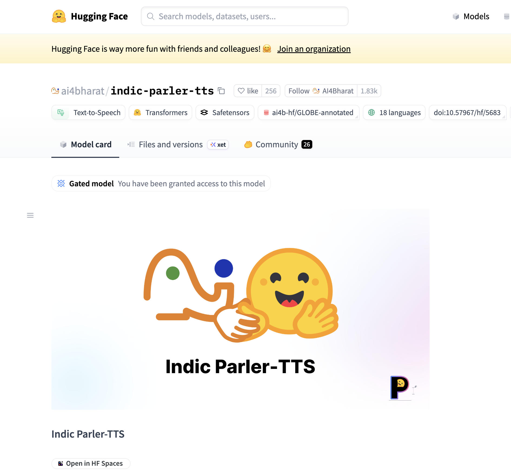

# Mitra (मित्रम्) — Sanskrit-Speaking Robot on Reachy Mini

Mitra ("friend" in Sanskrit) is an interactive desktop robot built on the **Reachy Mini Lite**. Say **"mitra"** to wake it, show it any object and it names the object in Sanskrit, and converse with it — it understands English, Kannada, or Sanskrit, and always replies in spoken Sanskrit. All inference runs **locally** on the host Mac with open-source models; no internet is needed at runtime.

## Architecture

### Option A — fully local inference (v1 target)


### Option B — cloud-extended inference (speech + wake word stay local)


### What happens when you say "hey mitra" — sequence of execution


Time flows downward: messages 1–7 are the wake-and-greet phase; 8–17 are one conversation turn, repeating until 30 seconds of silence puts Mitra back to sleep. The numbers on the Option A/B architecture arrows above mark the same order on the component view.

*Editable diagram sources: [architecture-local.excalidraw](architecture-local.excalidraw) · [architecture-cloud.excalidraw](architecture-cloud.excalidraw) · [flow-wake.excalidraw](flow-wake.excalidraw) — open at [excalidraw.com](https://excalidraw.com) or with the VS Code Excalidraw extension. Regenerate all three with `python scripts/gen_diagrams.py`.*

**Flow in one paragraph:** the robot's microphones stream over USB through the `reachy-mini` SDK to a local **openWakeWord** model listening for "mitra". On wake, the robot nods and greets; **Silero VAD** segments utterances, **Whisper** transcribes them (with language detection across English/Kannada/Sanskrit), and a **Strands Agent** — using the **OllamaModel provider** against a local **Qwen3-VL 8B** (conversation + vision + native tool calling) — produces a short Sanskrit reply. Replies pass a Devanagari validator, get spoken by **AI4Bharat Indic Parler-TTS**, and play through the robot's speaker. Object questions make the model call its `capture_image` tool, with a **human-verified Sanskrit lexicon cache** overriding generated names for accuracy.

**Extending to the cloud (Option B)** is a one-line Strands provider swap — `OllamaModel` → `AnthropicModel`/`BedrockModel`. The agent, tools, prompts, and validator are unchanged; wake word, ASR, and TTS stay on the host so raw microphone audio never leaves it, and the local model remains installed as an offline fallback. Details in [DESIGN.md §1.5](DESIGN.md).

## New to AI? How the Pieces Fit

If words like "model", "Ollama", and "agent" are new to you, read this first — every other document assumes these ideas.

**A model is a file of numbers, not a program (and not a Docker image).** When you run `ollama pull qwen3-vl:8b`, you download ~6 GB of *weights* — billions of numbers learned during training, plus a little metadata. The file does nothing by itself; it can't be "started" any more than a spreadsheet can. Ollama's commands *look* like Docker on purpose (`pull`, `name:tag`, layers with `sha256:` digests, even a "Modelfile") because it borrowed Docker's convenient *distribution* style — but there is no container, no operating system inside, nothing "running in" the model. It's data.

**Ollama is the serving layer — the thing that makes the numbers useful.** `ollama serve` is a small server on your laptop (at `http://localhost:11434`) that loads the weights into memory, runs them on your Mac's GPU, and offers a simple HTTP API: send text in, get generated text back. This is the same shape as ChatGPT or Claude — model weights behind a serving API — except the whole thing lives on your machine. That's the point of Mitra's design: your voice and camera images never leave your laptop.

**The other AI pieces are specialist models, each with its own job:**

| Piece | Job | In one line |
|---|---|---|
| Wake word (openWakeWord) | Hear "mitra" | A tiny always-on model that listens for one word and nothing else — so the big models stay idle (and your privacy stays intact) until you call |
| VAD (Silero) | Detect speech | Notices when you start and stop talking, so we know when an utterance is complete |
| ASR (Whisper) | Speech → text | Turns your audio into written words ("automatic speech recognition") |
| LLM/VLM (Qwen3-VL via Ollama) | Think | The large language model: reads your words (and camera images — the "V" is for vision) and writes the Sanskrit reply |
| TTS (Indic Parler-TTS) | Text → speech | Turns the written Sanskrit into a spoken voice ("text to speech") |

**An "agent" is an LLM that can use tools.** A plain LLM can only write text. The Strands Agents SDK wraps our LLM in a loop where the model may also *call functions we hand it* — Mitra gives it four: `capture_image` (take a photo), `speak_sanskrit` (talk), `nod` (move the head), and `end_session` (go back to sleep). When you ask "what is this?", the model itself decides to call `capture_image`, looks at the frame, and answers. The robot is not an agent and never calls the model — it is the *body* (camera, microphones, speaker, motors); the agent is the *brain*; and a small state machine (the orchestrator) is the *nervous system* connecting them.

## Documents

| Doc | Contents |
|---|---|
| [REQUIREMENTS.md](REQUIREMENTS.md) | Goals, functional requirements, hardware/memory budget, risks, phased plan |
| [DESIGN.md](DESIGN.md) | Module design, Strands ↔ Reachy Mini integration (why core `strands` with custom tools rather than `strands-robots`), state machine, prompting, testing |
| [CLAUDE.md](CLAUDE.md) | Project context for Claude Code sessions: load-bearing decisions, conventions, how to regenerate diagrams |

## Stack at a Glance

| Layer | Component |
|---|---|
| Robot | Reachy Mini Lite (`reachy-mini` Python SDK, USB-tethered) |
| Host | MacBook Pro M1 Max, 32 GB — all models local (~13.5 GB resident) |
| Wake word | openWakeWord (custom "mitra" model) |
| ASR | Whisper large-v3 (en/kn) + Sanskrit fine-tune |
| LLM + vision | Qwen3-VL 8B Instruct Q4 via Ollama (native tool calling) |
| TTS | AI4Bharat Indic Parler-TTS (Sanskrit) |
| Agent | Strands Agents SDK (core) with Ollama provider; robot actions as tools |

## Run in Simulation (no robot needed)

The `reachy-mini` SDK ships a **MuJoCo simulation backend**: the daemon started with `--sim` behaves exactly like a real Reachy Mini Lite on USB — same localhost daemon, same `ReachyMini()` client. Because all hardware access in Mitra goes through `src/robot/reachy.py`, the entire pipeline runs unmodified against the simulator; only which daemon is running changes.

**What maps where:** head motion (`nod`) animates in the MuJoCo viewer; `capture_image` returns frames rendered from the simulated robot's viewpoint (the `minimal` scene includes an apple, a croissant, and a duck on a table — *एतत् सेवफलम् अस्ति* is testable today); microphone and speaker map to the **Mac's own audio devices**, so the full wake-word → VAD → Whisper → Parler-TTS chain runs for real through laptop audio (software echo cancellation via GStreamer replaces the robot's XMOS hardware AEC). Not represented in sim: the Lite's 2-mic far-field acoustics (FR-1.4 accuracy targets), real camera optics/lighting, the 5 W speaker, and sound-source localization — those remain hardware checks in Phases 0–1.

### Setup (macOS)

> **⚠️ Always create and activate the project venv first.** The system `pip`/`python3` on macOS are often broken or too old (Python ≥3.10 is required); every install and run below assumes the venv is active — re-activate it in every new terminal.

1. **Environment** (from this `mitra/` directory; uses [uv](https://docs.astral.sh/uv/) to provision Python 3.12 if the system lacks it):

   ```bash
   cd mitra
   uv venv .venv --python 3.12
   source .venv/bin/activate        # do this in every new terminal
   ```

2. **Install the SDK with the simulation extra** (Pollen recommends plain `pip` over `uv` on macOS for the MuJoCo packages):

   ```bash
   pip install "reachy-mini[mujoco]"
   ```

3. **Start the simulated robot.** On macOS the MuJoCo GUI requires the `mjpython` launcher (Linux/Windows use `reachy-mini-daemon --sim` instead):

   ```bash
   mjpython -m reachy_mini.daemon.app.main --sim --scene minimal
   ```

   A 3D viewer opens (drag to rotate, scroll to zoom). Keep this terminal running — it is the daemon. Verify at <http://localhost:8000/docs>.

   > **Gotcha:** if `mjpython` segfaults in `libgstpython.dylib`, rename that GStreamer plugin so it isn't auto-loaded (official workaround; doesn't affect audio/video):
   >
   > ```bash
   > mv $(python -c "import gstreamer_python, pathlib; print(pathlib.Path(gstreamer_python.__file__).parent / 'lib/gstreamer-1.0/libgstpython.dylib')") \
   >    $(python -c "import gstreamer_python, pathlib; print(pathlib.Path(gstreamer_python.__file__).parent / 'lib/gstreamer-1.0/libgstpython_.dylib')")
   > ```

4. **Smoke test** (second terminal, same venv) — exercises the exact primitives Mitra's tools wrap:

   ```python
   from reachy_mini import ReachyMini
   from reachy_mini.utils import create_head_pose

   with ReachyMini() as mini:              # auto-connects to the sim daemon on localhost
       # "nod" — what robot.head.nod() wraps
       mini.goto_target(head=create_head_pose(z=20, roll=10, mm=True, degrees=True), duration=0.5)
       mini.goto_target(head=create_head_pose(), duration=0.5)

       # "capture_image" — frame of the MuJoCo scene, numpy (H, W, 3) uint8
       frame = mini.media.get_frame()
       print("camera frame:", frame.shape, frame.dtype)
   ```

5. **Switching to hardware:** plug in the Reachy Mini Lite over USB and run `reachy-mini-daemon` (no `--sim`). The same code connects to the real robot.

References: [simulation setup guide](https://github.com/pollen-robotics/reachy_mini/blob/main/docs/source/platforms/simulation/get_started.md) · [SDK installation](https://github.com/pollen-robotics/reachy_mini/blob/main/docs/source/SDK/installation.md) · [Python SDK media APIs](https://github.com/pollen-robotics/reachy_mini/blob/main/docs/source/SDK/python-sdk.md)

## Running

### One-time installation

Everything below assumes the venv is active (`source .venv/bin/activate` — see Setup above).

```bash
cd mitra
pip install -e '.[agent,wake,vad,asr]'          # agent + speech-input layers
pip install torch transformers git+https://github.com/huggingface/parler-tts.git   # Sanskrit TTS
ollama pull qwen3-vl:8b-instruct                # the LLM (~6 GB, one time)
```

**Unlock the Sanskrit voice** (one time — the TTS model is a *gated* Hugging Face repo with automatic approval):

1. Create a free account at [huggingface.co](https://huggingface.co/join) if you don't have one.
2. While logged in, open [ai4bharat/indic-parler-tts](https://huggingface.co/ai4bharat/indic-parler-tts) and click **"Agree and access repository"** — access is granted instantly.
3. Create a *read* token at [huggingface.co/settings/tokens](https://huggingface.co/settings/tokens) and log the machine in: `hf auth login` (paste the token when prompted).

When it worked, the model page shows this badge instead of the request form — that's your goal state:



Skip this and Mitra still speaks: it automatically falls back to an ungated Hindi VITS voice (`facebook/mms-tts-hin`) that reads Devanagari — intelligible, but its Sanskrit pronunciation is approximate. The console warns when the fallback is in use.

> **⚠️ Ollama must be the native Apple Silicon build.** Install the official app from [ollama.com/download](https://ollama.com/download). An Intel-Homebrew Ollama at `/usr/local` runs under Rosetta with **no GPU access** — replies take ~60 s instead of ~3 s. Verify with `ollama ps` after a query: it must say `100% GPU`.
>
> **⚠️ Use the `:8b-instruct` tag, not `:8b`.** The bare tag is the *thinking* variant — it burns the latency budget on hidden reasoning and returns empty replies.

### Talking to Mitra — three processes

| Where | Command | Role |
|---|---|---|
| Terminal 1 | `mjpython -m reachy_mini.daemon.app.main --sim --scene minimal` | The **robot**: simulator daemon + MuJoCo viewer window. With a real Reachy Mini Lite on USB, run `reachy-mini-daemon` instead — nothing else changes. |
| Ollama app, or Terminal 2 | open the Ollama menu-bar app (it runs the server itself), or run `ollama serve` | The **LLM serving layer** on `localhost:11434` |
| Terminal 3 | `python main.py --debug` | **Mitra**: wake word, ears, brain wiring, voice |

Remember `source .venv/bin/activate` in every terminal. When all three are up: say **"hey mitra"** near the microphone → the robot nods and greets you with नमस्ते → speak English, Kannada, or Sanskrit → it replies in spoken Sanskrit. In simulation, the robot's microphone and speaker are your Mac's, and its camera sees the simulated table (duck, croissant, apple — all three have verified lexicon entries).

> **First run is slow — by design, up front.** At startup Mitra *warms up* its speech models: it runs each ASR engine once on silence so the one-time downloads (whisper-tiny for the wake word, then Whisper large-v3, ~3 GB, for transcription) happen right away with a "warming up" log line — instead of silently stalling your first question for minutes. The TTS voice (~2 GB) still downloads on the first reply. After these one-time downloads the whole pipeline is local — it works with Wi-Fi off (the design goal).

### Development commands

```bash
.venv/bin/python -m pytest              # 59 tests; tests/hw/ auto-skips without a daemon
.venv/bin/python main.py --check        # what's installed / is Ollama up / lexicon count
mitra-lexicon --db data/lexicon.db      # review model-generated Sanskrit names (FR-2.5)
```

## Status

Implemented and verified: orchestrator state machine, robot wrapper (+`FakeReachy`), agent tools, validator, lexicon store (53-entry seed), language detector, wake engines (ASR-transcript now; openWakeWord once the custom "mitra" model is trained), `main.py` wiring — 59 tests green, including live-simulator smoke tests. Live-verified on the M1 Max: Strands agent → Ollama (`qwen3-vl:8b-instruct`, 100% GPU) answers English/Kannada/Sanskrit input with valid Devanagari Sanskrit in ~3 s warm. Remaining Phase 1–4 work: train the custom wake model, verify Parler-TTS latency on MPS, Sanskrit-ASR evaluation, and the seed-lexicon review by a Sanskrit reviewer (FR-2.6).

Predecessor feasibility study (edge Jetson / AWS Bedrock design) is preserved in git history: `git show 40639db:mitra/README.md`.
